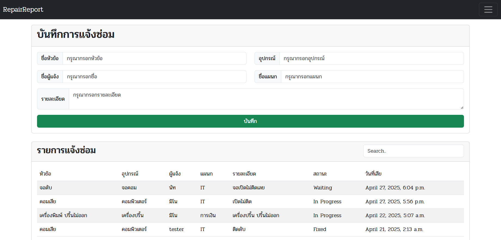
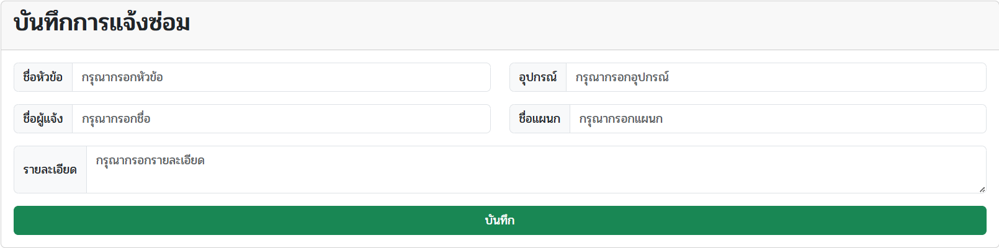
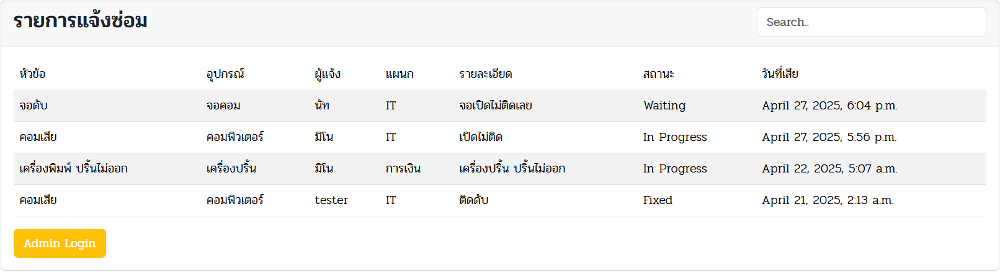
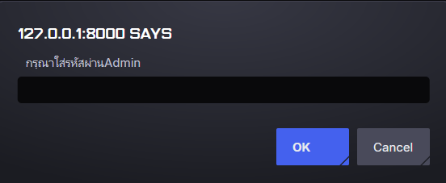
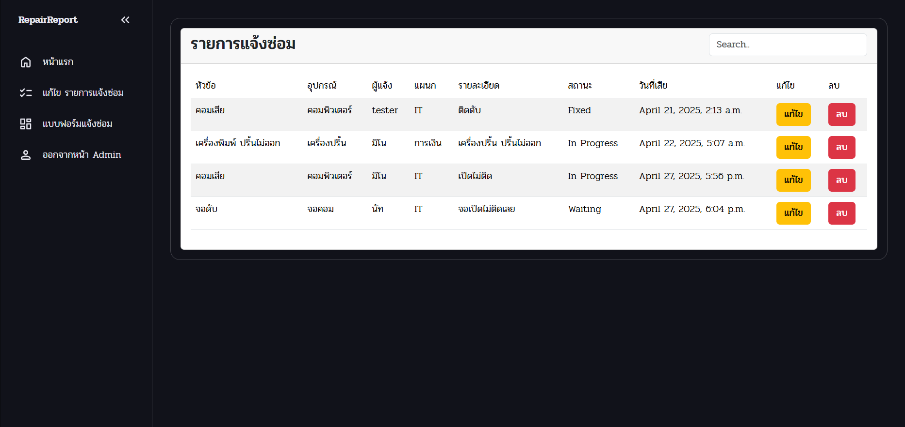
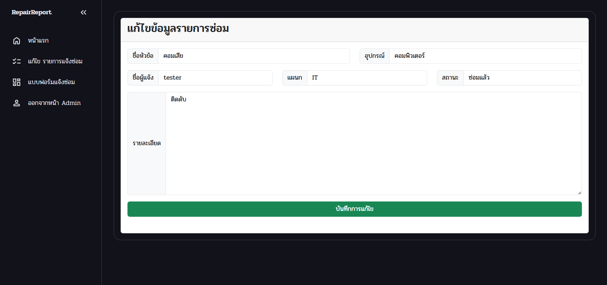
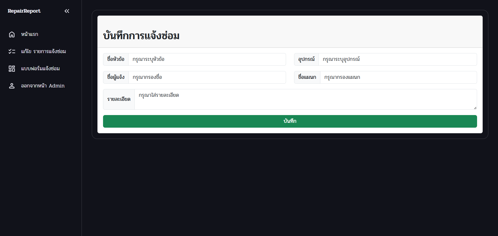

# 📚 Repair_Report_Maker

> เว็บแอปพลิเคชันสำหรับบันทึกและจัดการรายการแจ้งซ่อม พร้อมฟังก์ชันค้นหา แก้ไข และลบข้อมูลได้อย่างสะดวก

## 🚀 Features

- เพิ่มบันทึกรายงานแจ้งซ่อม
- แก้ไขและลบ รายงานแจ้งซ่อม


## 📦 Installation

### 1. Clone โปรเจค
```bash
git clone https://github.com/NuttoSPU/Repair_Report.git
cd Repair_Report
```
### 2. รัน Development Server
```bash
python manage.py runserver
```

# 📚 ตัวอย่างหน้าเว็บ

## ส่วนของ User
ส่วนของ User จากประกอบด้วย 2 ส่วนหลัก คือ


### แบบฟอร์ม บันทึกรายงานแจ้งซ่อม
แบบฟอร์ม สำหรับเพิ่มรายงานแจ้งซ่อม โดยการใส่ข้อมูลรายละเอียดต่างตามหัวข้อ และกดบันทึก


### ตารางรายงานแจ้งซ่อม
รายการแจ้งซ่อม สำหรับแสดงรายงานแจ้งซ่อมทั้งหมด สามารถใช้ช่อง Search ทางขวาบนเพื่อค้นหารายงานที่ต้องการหาได้


## ส่วนของ Admin
ส่วนของ Admin จะต้องเข้าสู่ระบบด้วยปุ่ม Admin Login 

<details>
  <summary>และทำการกรอกรหัสให้ถูกต้อง</summary>(1234)
</details>



## ส่วนหน้าหลักของ Admin
เมื่อเข้าสู่ระบบหลังบ้าน ก็จะพบกับ ตารางรายงานแจ้งซ่อม โดย Admin จะสามารถ แก้ไขข้อมูล Update สถานะ หรือ ลบรายงานแจ้งซ่อมได้

### แบบฟอร์มแก้ไขรายงานแจ้งซ่อม
เมื่อทำการกดปุ่มแก้ไขก็จะนำมาสู่แบบฟอร์มแก้ไขรายงานแจ้งซ่อม
โดยแบบฟอร์ม จะทำให้ Admin สามารถแก้ไขข้อมูล และ Update รายงานแจ้งซ่อมได้

### แบบฟอร์ม เพิ่มรายงานแจ้งซ่อม
นอกจากนั้นยังมีฟอร์มสำหรับเพิ่มรายงานแจ้งซ่อม เพื่อทำให้ Admin ไม่จำเป็นต้องออกจากระบบหลังบ้าน เพื่อที่จะเพิ่มรายงานนั้นเอง

